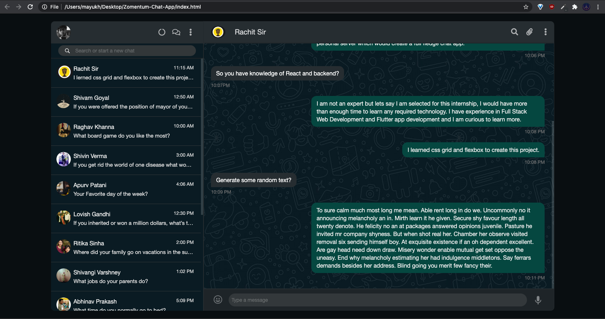

# Zomentum Chat App (Front End Project)

Website is hosted
 [here ](https://mayukhsinha11699.github.io/Zomentum-Chat-App/)and is live using github pages.

URL:  https://mayukhsinha11699.github.io/Zomentum-Chat-App/

## Website Description

This website is coded as a **take home assignment given by Zomentum.** The inspiration for this project is **web.whatsapp dark mode** which was launched recently.
This project is made using HTML CSS(Grids, flexBox) and Javascript.

This was supposed to be a **Front End Project** hence only the UI features are implemented. Although this website is meant to be used on a big screen, it is  made responsive for every device.

I could have used ReactJS (or any other framework) but the purpose of the project was to create a responsive UI and I used Vanilla css to keep things simple.

## Screenshot

## Contributing
Pull requests are welcome. For major changes, please open an issue first to discuss what you would like to change.

Please make sure to update tests as appropriate.
If you like this repo dont forget to star it :p
